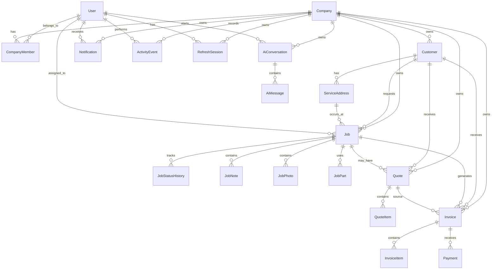

# 04 — Entity Relationship Diagram

## Logical model

## Core entities

### Company
Tenant boundary. All core business data is owned by one company.

### CompanyMember
Join entity linking users to a company and a role.

### Customer
The person/business requesting service.

### ServiceAddress
A customer can have more than one service location.

### Job
The operational center of the product. Contains problem, priority, status, schedule and assignment.

### Quote
Commercial proposal attached to customer/job.

### Invoice
Money owed after approved/finished work.

### Payment
Immutable financial event representing money received/recorded.

### ActivityEvent
Audit/operational history. Important actions should be append-only.

### RefreshSession
Server-side control plane for refresh-token rotation/revocation.

### AiConversation / AiMessage
Stores user-facing AI interactions. Never use raw LLM text as an authorization source.

## Cardinality rules

- One user can belong to many companies.
- One company has many members.
- One customer belongs to one company.
- One customer can have many service addresses.
- One job belongs to one company and one customer.
- One job can have zero or one active technician assignment in MVP.
- One quote belongs to one company and may attach to one job.
- One invoice belongs to one company and can contain many line items.
- One invoice can have many payment events.

## Audit principle

Important state changes are not overwritten without trace. History records preserve who changed what and when.
