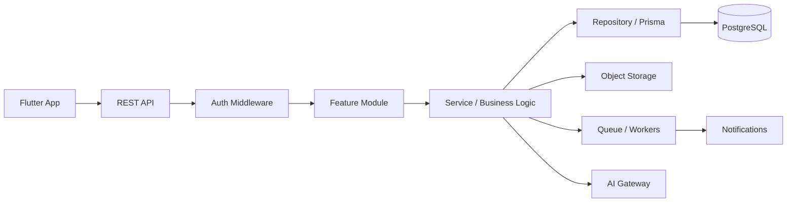

# Aera — Architecture

> This is the single source of truth for runtime architecture, backend boundaries, API conventions, deployment shape, and architecture decisions.


## 1. Architecture goal

Use a modular monolith first: one deployable backend, strict internal modules, one PostgreSQL database. This avoids premature microservices while keeping boundaries clear enough to extract services later.

## 2. Technology decisions

### Mobile
- Flutter/Dart.
- Riverpod for application state.
- go_router for navigation.
- Dio or `http` for REST calls.
- Local persistence for cached/session data and future sync queue.
- Image compression before upload.

### Backend
- Node.js LTS.
- TypeScript with strict mode.
- Express 5.
- Zod for request/response validation.
- Prisma ORM.
- Pino structured logging.
- OpenTelemetry-compatible tracing later.
- JWT access tokens.
- Rotating refresh-token sessions.

### Database
- PostgreSQL.
- UUID identifiers.
- UTC timestamps.
- Integer minor units for money.
- PostgreSQL constraints + application invariants.

### Object storage
- S3-compatible object storage or Supabase Storage.
- Database stores metadata and object keys, not image binary data.

### Async jobs
Start with a queue abstraction. Add Redis/BullMQ when background load requires it.

Use background jobs for:
- notifications,
- image processing,
- email/SMS,
- AI summarization,
- scheduled invoice reminders.

Do not make the primary request wait for non-critical side effects.

## 3. High-level flow



## 4. Backend module structure

```text
backend/
  src/
    app.ts
    server.ts
    config/
    common/
      errors/
      http/
      logging/
      auth/
      pagination/
      validation/
    modules/
      auth/
      companies/
      members/
      customers/
      jobs/
      scheduling/
      quotes/
      invoices/
      payments/
      files/
      notifications/
      activity/
      ai/
    db/
      prisma.ts
    routes/
    workers/
  prisma/
    schema.prisma
    migrations/
  tests/
```

Each feature module should be internally organized around:

```text
route → controller → service → repository → database
                    ↘ integrations
```

Controllers should be thin. Business rules live in services/domain logic, not HTTP handlers.

## 5. Multi-tenancy model

Every request resolves:

```text
access token
  ↓
user id
  ↓
company membership
  ↓
role
  ↓
company id
```

Services must require `companyId` explicitly. Repositories must scope queries by `companyId` unless the operation is truly global.

Never trust a `companyId` supplied by the Flutter client.

## 6. Authentication

Access token:
- Short-lived.
- Contains user/session identity, not sensitive business data.

Refresh token:
- Long-lived.
- Stored server-side as a hash/identifier so sessions can be revoked.
- Rotated on use.

Security:
- Rate-limit login.
- Generic credential error messages.
- Revoke refresh session on suspicious reuse.

## 7. Authorization

Use RBAC plus ownership/assignment checks.

Example:

```text
owner
  → all company resources

dispatcher
  → customers, jobs, schedule, quotes, invoices
  → cannot modify company security/billing settings unless granted

technician
  → assigned jobs
  → own execution records
  → limited customer data
```

Authorization must be evaluated against the database record, not only a role string from the client.

## 8. Job state machine

```text
NEW
 ↓
QUOTING ──→ SCHEDULED
              ↓
           EN_ROUTE
              ↓
         IN_PROGRESS
          ↙       ↘
WAITING_PARTS    COMPLETED
    ↓
IN_PROGRESS

Any active state → CANCELLED (subject to permission)
```

Every transition records actor, timestamp, previous state, new state, and optional reason.

## 9. Transaction boundaries

Use database transactions when one business action spans multiple writes.

Examples:

- quote approval + job activation;
- job completion + invoice creation;
- payment record + invoice balance update;
- company creation + owner membership;
- invite acceptance + membership creation.

The unit must commit together or roll back together. Prisma documents this transaction pattern, and PostgreSQL provides defined transaction isolation behavior. citehttps://www.prisma.io/docs/orm/prisma-client/queries/transactionshttps://www.postgresql.org/docs/current/transaction-iso.html

## 10. API versioning

Base path:

```text
/api/v1
```

Envelope:

```json
{
  "data": {},
  "meta": {}
}
```

Errors:

```json
{
  "error": {
    "code": "JOB_NOT_FOUND",
    "message": "Job not found"
  },
  "requestId": "..."
}
```

## 11. Deployment shape

Portfolio deployment:

```text
Flutter APK / TestFlight
        ↓
HTTPS
        ↓
Node API service
        ↓
Managed PostgreSQL
        ↓
Object storage
```

Production evolution:

```text
CDN / WAF
   ↓
API instances
   ↓
PostgreSQL + connection pooling
   ↓
Redis/queue
   ↓
workers
```

## 12. Architecture rules

- No SQL/database calls from Flutter.
- No business logic in UI widgets.
- No direct Prisma calls from controllers.
- No unvalidated request body.
- No cross-tenant query without explicit authorization.
- No hidden global mutable state.
- No network call in a tight Flutter build loop.
- No synchronous waiting for non-critical notifications/AI work.

---

# API Contract


## 1. Base URL

```text
/api/v1
```

## 2. Authentication endpoints

```text
POST   /auth/register
POST   /auth/login
POST   /auth/refresh
POST   /auth/logout
GET    /auth/me
```

## 3. Company/team

```text
POST   /companies
GET    /companies/:companyId
GET    /companies/:companyId/members
POST   /companies/:companyId/invitations
PATCH  /companies/:companyId/members/:memberId
DELETE /companies/:companyId/members/:memberId
```

The client should not choose an arbitrary tenant context. Company access is derived from authenticated membership and validated server-side.

## 4. Customers

```text
GET    /customers
POST   /customers
GET    /customers/:customerId
PATCH  /customers/:customerId
DELETE /customers/:customerId
GET    /customers/:customerId/jobs
```

Supported query patterns:

```text
?page=1&pageSize=20&search=sarah&status=ACTIVE
```

Use cursor pagination later for very large histories.

## 5. Jobs

```text
GET    /jobs
POST   /jobs
GET    /jobs/:jobId
PATCH  /jobs/:jobId
POST   /jobs/:jobId/assign
POST   /jobs/:jobId/status
POST   /jobs/:jobId/notes
POST   /jobs/:jobId/photos/presign
POST   /jobs/:jobId/complete
GET    /jobs/:jobId/history
```

Status mutation should be an explicit command rather than allowing clients to patch arbitrary status fields.

## 6. Scheduling

```text
GET    /schedule?date=YYYY-MM-DD
POST   /jobs/:jobId/schedule
POST   /jobs/:jobId/reschedule
```

## 7. Quotes

```text
POST   /quotes
GET    /quotes
GET    /quotes/:quoteId
POST   /quotes/:quoteId/send
GET    /quotes/shared/:shareToken
POST   /quotes/shared/:shareToken/respond
```

Quote creation calculates line totals, tax, discount, and total server-side.
Shared responses are customer-facing and create immutable approval events. An
approved quote remains attached to its existing job; scheduling continues that
job rather than creating a duplicate record.

## 8. Invoices/payments

```text
GET    /invoices
GET    /invoices/:invoiceId
POST   /invoices/from-job/:jobId
POST   /invoices/:invoiceId/issue
POST   /invoices/:invoiceId/payments
GET    /invoices/:invoiceId/payments
```

Payment mutations require an `Idempotency-Key` header. Invoice generation is
unique per company/job, and payment recording rejects amounts above the current
balance inside the same transaction that updates invoice state.

## 9. Customer portal

```text
POST /customers/:customerId/portal-access
GET  /portal/:token
POST /quotes/shared/:shareToken/respond
```

Portal tokens expire after 30 days and are scoped to one customer and company.
The public portal exposes appointment details, shared quotes, issued invoice
balances, and completed service history without exposing staff-only records.

## 9. Dashboard

```text
GET /dashboard/summary
GET /dashboard/today
GET /dashboard/alerts
```

Do not create a giant dashboard endpoint returning the entire database. Query only the data the screen actually needs.

## 10. AI

```text
POST /ai/conversations
GET  /ai/conversations
GET  /ai/conversations/:conversationId
POST /ai/conversations/:conversationId/messages
```

AI server architecture:

```text
Flutter
  ↓
POST message
  ↓
AI service
  ↓
authorized tools
  ↓
scoped application services
  ↓
PostgreSQL
```

The model never receives raw database credentials.

## 11. Error taxonomy

Examples:

```text
AUTH_INVALID_CREDENTIALS
AUTH_SESSION_EXPIRED
AUTH_FORBIDDEN
TENANT_ACCESS_DENIED
RESOURCE_NOT_FOUND
VALIDATION_FAILED
JOB_INVALID_STATUS_TRANSITION
QUOTE_ALREADY_DECIDED
INVOICE_ALREADY_VOID
PAYMENT_DUPLICATE
RATE_LIMITED
INTERNAL_ERROR
```

## 12. Idempotency

For retry-sensitive writes:

```http
Idempotency-Key: 6f4c...
```

Server stores the key and resulting operation state for an appropriate retention period.

Especially important for:
- payment recording;
- invoice issuing;
- customer-visible message sending;
- job completion if completion triggers invoice creation.

---

# Architecture Decision Records


## ADR-001 — Modular monolith first

**Decision:** Use one Node.js backend deployable as one service, internally divided into modules.

**Why:** The product is early-stage and needs speed of development, clear ownership of business rules, and low operational complexity. Microservices would add networking, deployment, observability, and consistency problems before the product needs them.

**Revisit when:** separate scaling/security/deployment requirements are demonstrated by measurements or organizational needs.

## ADR-002 — PostgreSQL over document database

**Decision:** PostgreSQL.

**Why:** Jobs, customers, schedules, quotes, invoices, payments, memberships, and audit history are relational and transaction-heavy. Strong constraints and transactional semantics are valuable.

## ADR-003 — Prisma as ORM

**Decision:** Prisma.

**Why:** Strong TypeScript developer experience, migrations, schema-first workflow and transaction support. Keep SQL knowledge as part of engineering competence; the ORM is not a replacement for database reasoning.

## ADR-004 — REST API

**Decision:** Versioned REST under `/api/v1`.

**Why:** Easy to inspect, debug, document and integrate with Flutter and future web/admin clients. GraphQL is unnecessary for the first product version.

## ADR-005 — JWT access + server-controlled refresh sessions

**Decision:** Short-lived access tokens plus revocable rotating refresh sessions.

**Why:** Mobile clients need persistent sessions while the company needs session revocation and security controls.

## ADR-006 — Server-authoritative business rules

**Decision:** Flutter is never authoritative for money, permissions, workflow transitions, or tenant scope.

**Why:** Clients can be modified, intercepted or out of date. Server-side invariants protect the business.

## ADR-007 — Integer minor-unit money

**Decision:** Store money as integer minor units and an explicit ISO-like currency code.

**Why:** Avoid floating-point rounding problems in billing logic.

## ADR-008 — Object storage for photos

**Decision:** Store photos outside PostgreSQL; store metadata/object keys in PostgreSQL.

**Why:** Keeps relational data compact and allows storage/CDN optimization.

## ADR-009 — Async side effects

**Decision:** Notifications, AI enrichment, and other slow secondary work should use an async abstraction.

**Why:** Primary user actions should not fail because a notification provider is temporarily unavailable.

## ADR-010 — AI is a tool caller, not an authority

**Decision:** AI may read data only through authorized tools and may never receive direct database access. Sensitive mutations require explicit typed commands with authorization.

**Why:** Prevents prompt injection and model output from becoming an authorization mechanism.

## Architecture ownership

This file owns system boundaries, technology choices, module structure, tenancy and authorization architecture, job-state architecture, transactions, REST API conventions, deployment, and ADRs. Coding standards and verification gates belong in `rules.md`.
