# Aera Architecture Diagram

## System Architecture Overview

```mermaid
graph TB
    subgraph "Client Layer"
        A[Flutter Mobile App]
        A1[Dashboard]
        A2[Customers]
        A3[Jobs]
        A4[Calendar]
        A5[Quotes]
        A6[Invoices]
        A7[Technician]
        A8[Customer Portal]
    end

    subgraph "API Layer"
        B[Node.js/Express API]
        B1[Authentication]
        B2[Customers Module]
        B3[Jobs Module]
        B4[Scheduling Module]
        B5[Quotes Module]
        B6[Invoices Module]
        B7[Portal Module]
        B8[AI Module]
        B9[Notifications Module]
    end

    subgraph "Business Logic Layer"
        C[Services]
        C1[Auth Service]
        C2[Customer Service]
        C3[Job Service]
        C4[Scheduling Service]
        C5[Quote Service]
        C6[Invoice Service]
        C7[Payment Service]
        C8[AI Gateway Service]
        C9[Notification Service]
    end

    subgraph "Data Access Layer"
        D[Prisma ORM]
        D1[Models]
        D2[Queries]
        D3[Migrations]
    end

    subgraph "Database Layer"
        E[(PostgreSQL)]
        E1[Companies]
        E2[Users]
        E3[Customers]
        E4[Jobs]
        E5[Quotes]
        E6[Invoices]
        E7[Notifications]
    end

    subgraph "External Services"
        F[Supabase]
        F1[PostgreSQL]
        F2[Storage]
        F3[Auth]
        G[AI Provider]
        G1[Gemini API]
        H[Email Service]
        H1[Resend]
        I[SMS Service]
        I1[TextBee]
        J[Push Service]
        J1[FCM]
    end

    A --> B
    A1 --> B2
    A2 --> B2
    A3 --> B3
    A4 --> B4
    A5 --> B5
    A6 --> B6
    A7 --> B3
    A8 --> B7

    B --> C
    B1 --> C1
    B2 --> C2
    B3 --> C3
    B4 --> C4
    B5 --> C5
    B6 --> C6
    B7 --> C2
    B8 --> C8
    B9 --> C9

    C --> D
    C1 --> D
    C2 --> D
    C3 --> D
    C4 --> D
    C5 --> D
    C6 --> D
    C7 --> D
    C8 --> D
    C9 --> D

    D --> E
    D1 --> E1
    D2 --> E2
    D3 --> E3
    D4 --> E4
    D5 --> E5
    D6 --> E6
    D7 --> E7

    C7 --> G
    C8 --> G
    C9 --> H
    C9 --> I
    C9 --> J

    E --> F
    F1 --> E
    C2 --> F2
    B1 --> F3

    style A fill:#e1f5ff
    style B fill:#fff4e1
    style C fill:#e8f5e9
    style D fill:#f3e5f5
    style E fill:#ffebee
    style F fill:#fce4ec
    style G fill:#e0f2f1
    style H fill:#fff3e0
    style I fill:#f1f8e9
    style J fill:#e8eaf6
```

## Authentication Flow

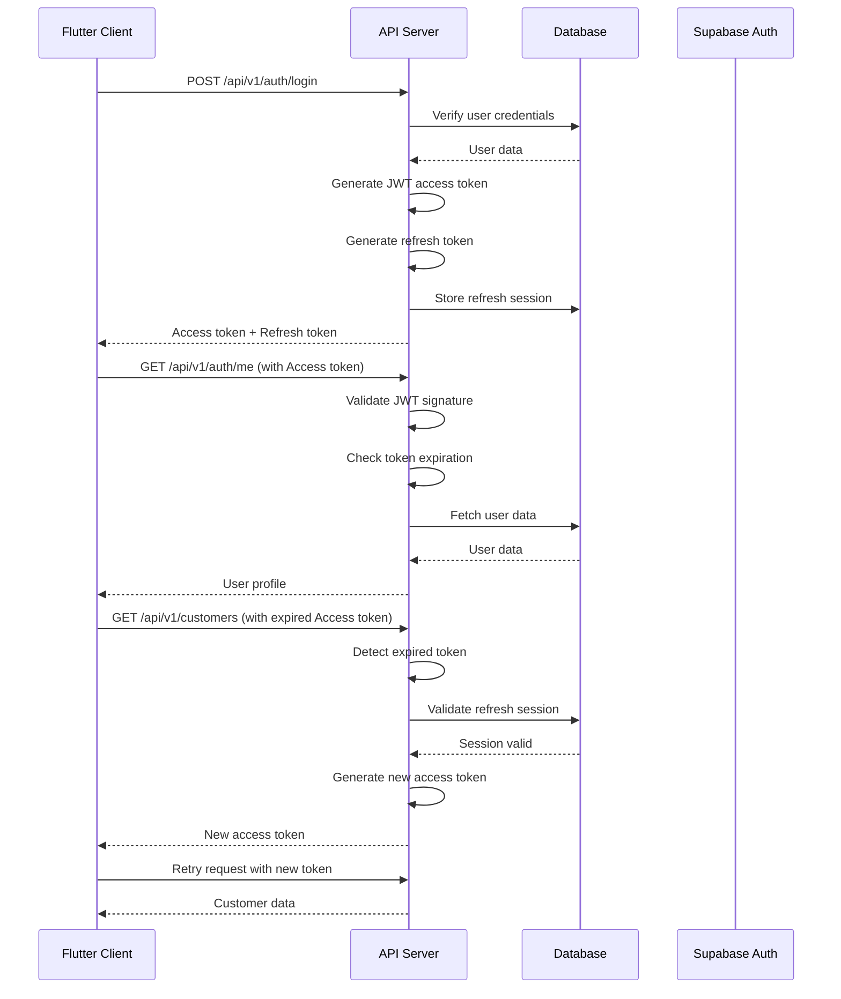

## Multi-Tenancy Architecture

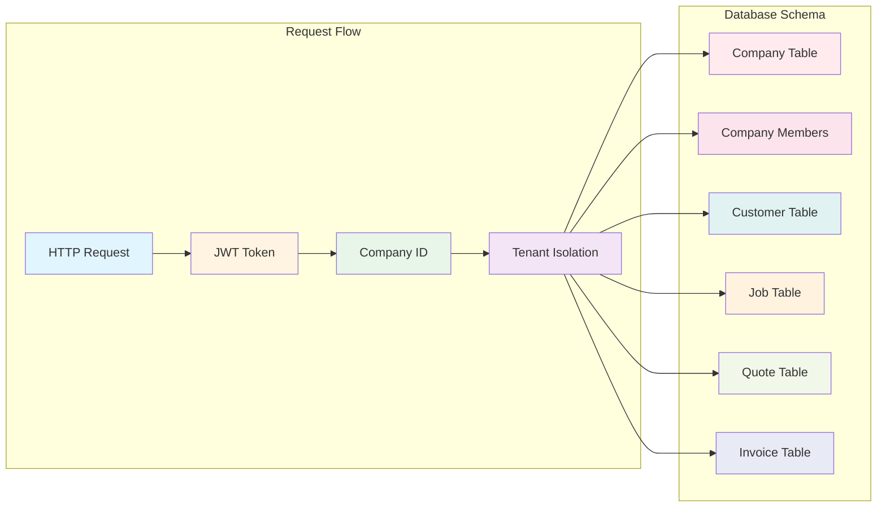

## Job Lifecycle Flow

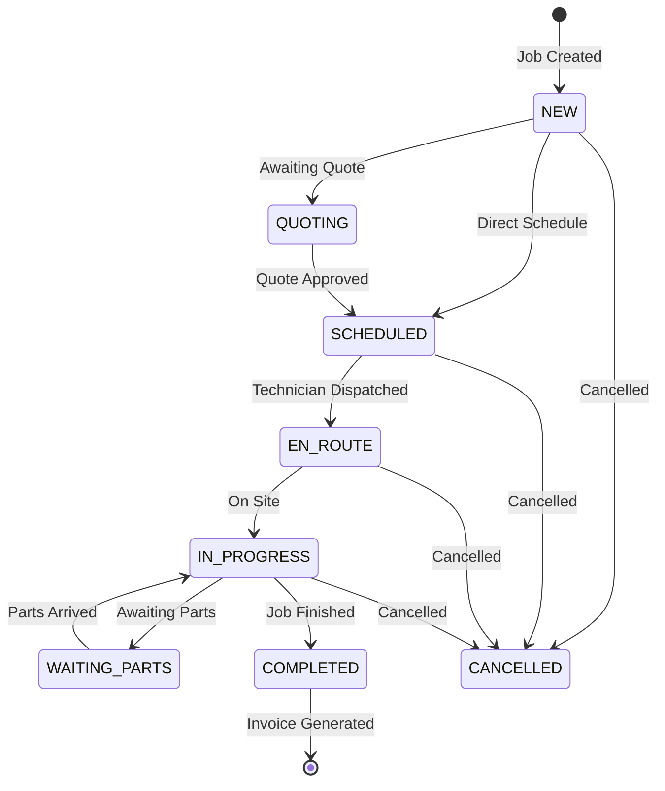

## Customer-to-Cash Flow

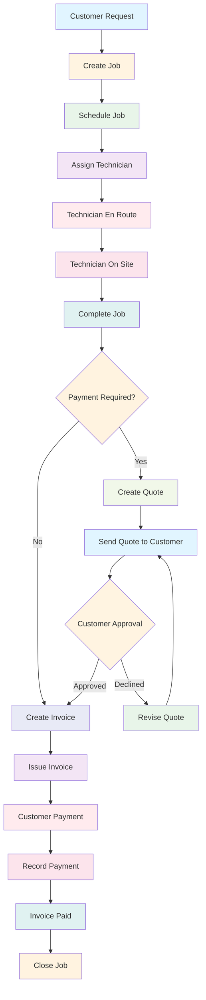

## Data Model Relationships

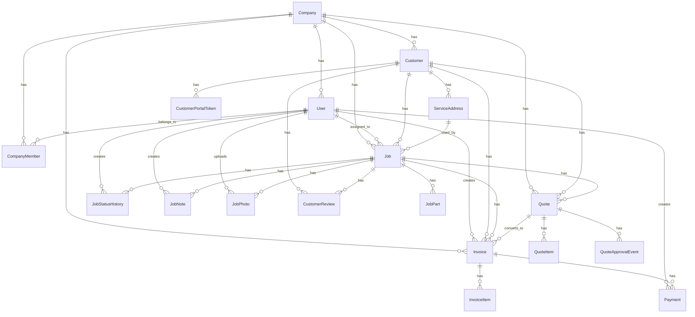

## API Layer Architecture

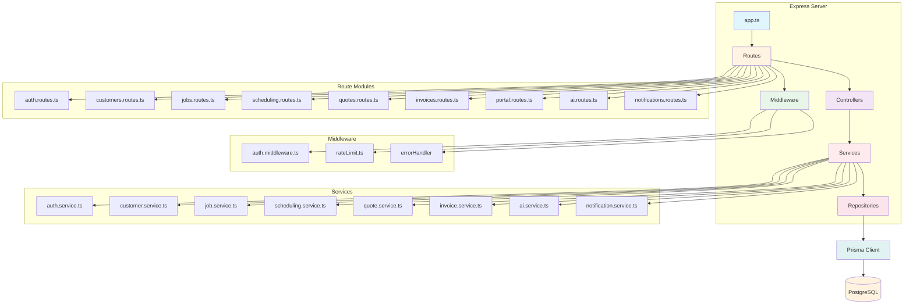

## Flutter App Architecture

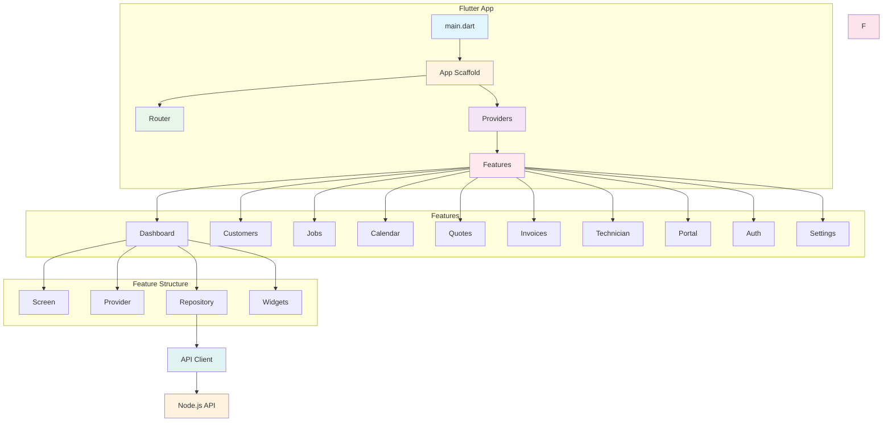

## Security Architecture

```mermaid
graph TB
    subgraph "Security Layers"
        A[Authentication]
        B[Authorization]
        C[Tenant Isolation]
        D[Data Validation]
        E[Rate Limiting]
    end

    subgraph "Authentication"
        A1[JWT Tokens]
        A2[Refresh Tokens]
        A3[Password Hashing]
        A4[Token Expiration]
    end

    subgraph "Authorization"
        B1[Role-Based Access]
        B2[Function-Level Policies]
        B3[Route Guards]
        B4[Membership Validation]
    end

    subgraph "Tenant Isolation"
        C1[Company Scoping]
        C2[Query Filters]
        C3[Cross-Company Prevention]
        C4[Membership Status Checks]
    end

    subgraph "Data Validation"
        D1[Zod Schemas]
        D2[Input Sanitization]
        D3[Output Validation]
        D4[SQL Injection Prevention]
    end

    subgraph "Rate Limiting"
        E1[Request Throttling]
        E2[IP-based Limits]
        E3[User-based Limits]
        E4[Endpoint-specific Limits]
    end

    A --> A1
    A --> A2
    A --> A3
    A --> A4

    B --> B1
    B --> B2
    B --> B3
    B --> B4

    C --> C1
    C --> C2
    C --> C3
    C --> C4

    D --> D1
    D --> D2
    D --> D3
    D --> D4

    E --> E1
    E --> E2
    E --> E3
    E --> E4

    style A fill:#e1f5ff
    style B fill:#fff4e1
    style C fill:#e8f5e9
    style D fill:#f3e5f5
    style E fill:#ffebee
```

## Deployment Architecture

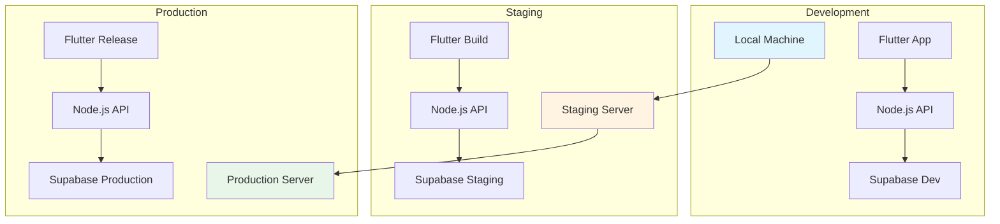

## Technology Stack

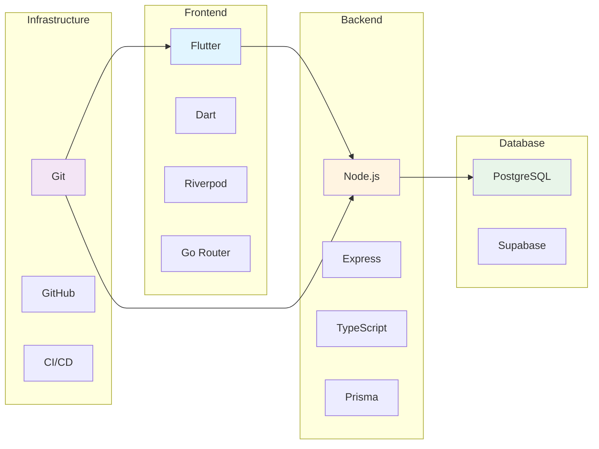

## Notes

- All diagrams use Mermaid syntax
- Render with Mermaid-compatible viewers (GitHub, VS Code, etc.)
- For interactive viewing, use Mermaid Live Editor: https://mermaid.live/
- Diagrams reflect the current architecture as of Phase H1
